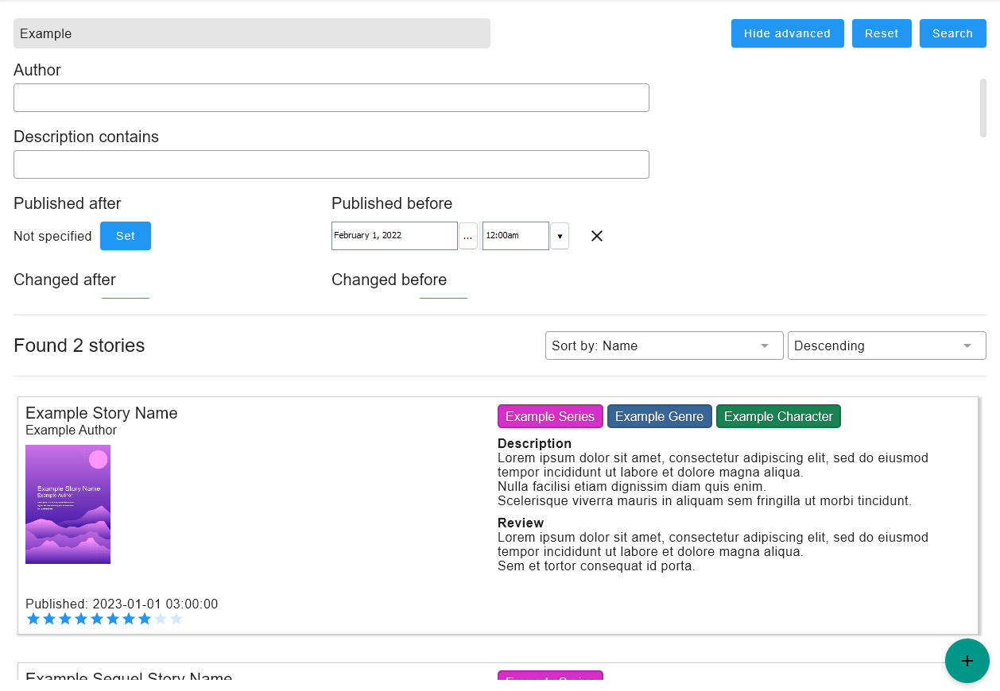
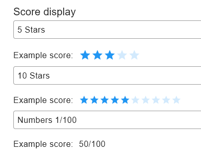
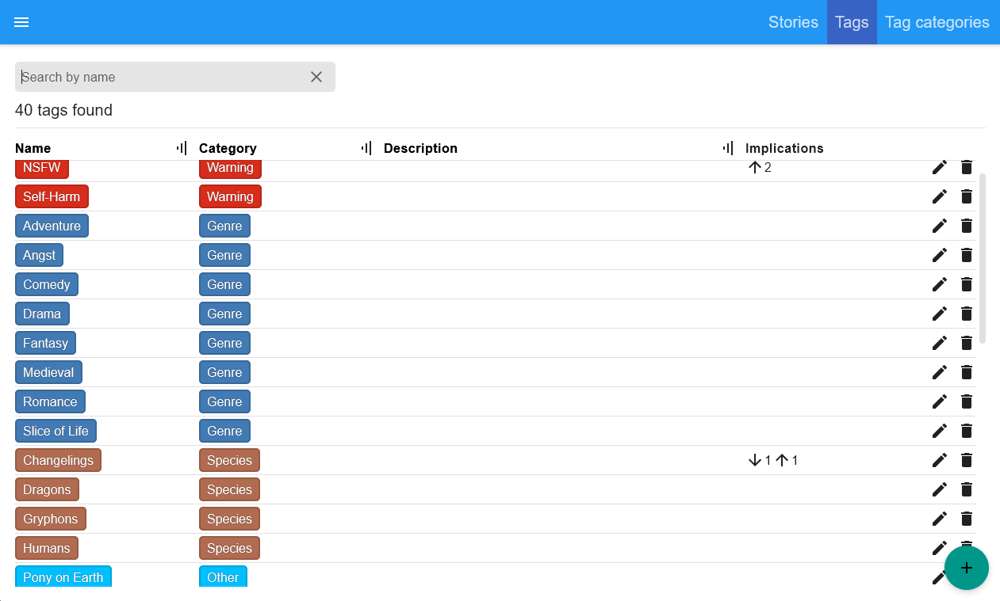
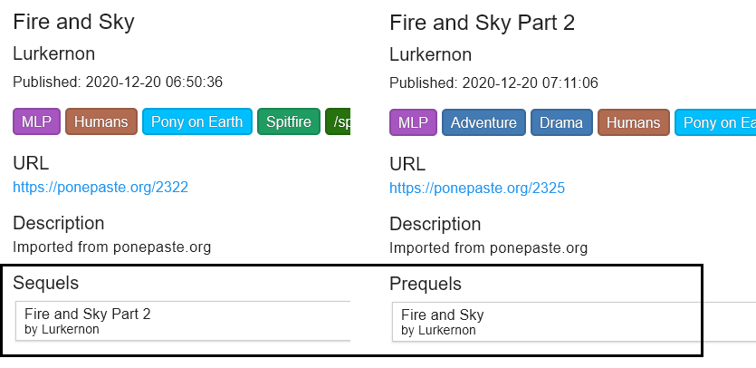
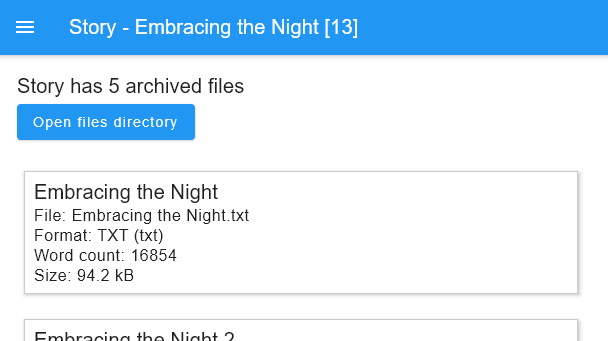
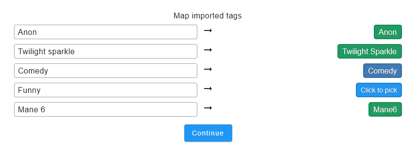
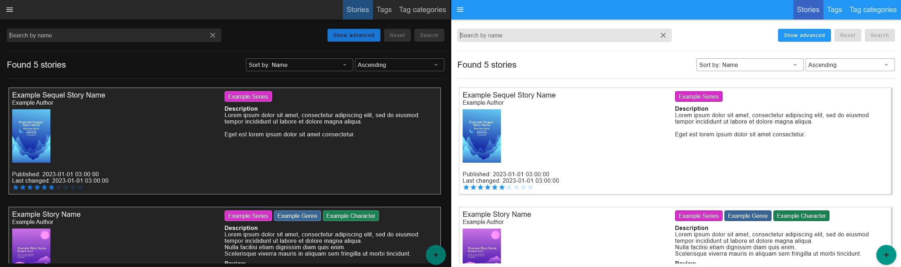

# Stuff I Read

Desktop app for keeping track of stories (books, fanfics) you read.

## Do you need this?

1. You read a lot of different stuff. Like in hundreds or even thousands.
2. You can't remember everything you read, and you have to keep track of that.
3. Also, you like to score stories and write reviews, even if only for yourself.
4. Maybe, you even re-read some stories.
5. Excel spreadsheet is not enough anymore.

## Development and support

**Stuff I Read** was created and tailored for my personal use-case,
but I will add features by request if there's a need.

### Technology

Built using [Compose Multiplatform](https://github.com/JetBrains/compose-multiplatform) framework (selected as
experiment/research).  
My personal opinion after working with it: don't use it for serious multiplatform development until 2025 or so.
Standard library is lacking, and framework is fragile. You will waste time re-implementing basic components,
exploring internals because documentation is minimal, and fighting obscure bugs.

## Features

### Browse stories with extensive search

You can browse your archive using advanced search. You can search by author, description,
publishing/last update dates, tags, score, review, content, word count and other parameters.

<b>Example</b>

### Review and score stories that you read

Write reviews and score stories, so you won't forget why you enjoyed reading a story.

#### Score formats
Multiple score formats are supported, including 5 stars, 10 stars, 10/10, 100/100.
Format can be changed at any time without breaking existing scores.

<b>Example</b>

### Tag system: tag categories, implied tags, search

To help with categorization stories can have fully customizable tags.

#### Tag category

Category provides order and color of the tag. Ordering can be very useful when story has dozens of tags.

#### Tag implications

Tags can imply other tags. For example, tag of character can imply their species, and now you can search
for stories with that species without explicitly adding the species tag.  
You can edit implications at any moment and all stories will be affected by the change.

<b>Examples of tags, you can create your own at any moment</b>

### Sequels & prequels

Easy navigation for story sequels/prequels.

<b>Example</b>

### Local story archive

Files with story content can be locally archived. Strictly speaking all formats are supported,
but EPUB, HTML, PDF and TXT have special handling, for example word counting.  
Files can represent not only the whole story, but individual chapters as well as any additional content too.

<b>Example</b>

### Import stories from selection of websites

Currently supported:

- [archiveofourown.org](https://archiveofourown.org/)  
  Work can be imported in multiple file formats if needed.
- [pastebin.com](https://pastebin.com/)  
  Multiple pastes can be imported as one story.
- [poneb.in](https://poneb.in/) (Pony)  
  Multiple pastes can be imported as one story.
- [ponepaste.org](https://ponepaste.org/) (Pony)  
  Multiple pastes can be imported as one story.

||Don't worry, you can hide pony website integrations in settings||  
If website has story tags - they can be imported and mapped to local tags:

<b>Example</b>

### Misc

#### Dark / light theme
Use system theme or select one yourself.

<b>Example</b>

## Planned features

### Localization support

Support at least English and Russian. Also support language-based import sources settings.

### More import sources

Feel free to request other websites!

- FimFiction.net - Pony (has excellent API, but need to request access).
- PonyFiction.org - Pony, Russian
- FicBook.net - Russian

### Read Later and In Reading Lists

Read Later List: stuff that you want to read sometime. Prioritized, with notes, url, date added, etc.  
In Reading List: stuff that you are reading right now.  
Also, a way to move stories between lists: Read Later -> In Reading -> Archive

### Stats and graphs

Page with aggregated stats on everything you read, including: total word count, score distribution,
time distribution, and so on.

### File format conversions

To be able to convert EPUB to PDF, TXT to HTML and so on.

### Track individual reads

As of now only first read and last read dates are supported, but I think it would be cool to know about
specific dates when you read something.

### Android version

Compose Multiplatform "supports" it, but I personally don't need it. So it's low priority.

## Story archive format

**Story archive** is a folder and consists of **tags** (`tags.json`),
**stories** (individual folders with story info in `story.json` and archived `files`).

Q: Why use separate files instead of something like SQLite database?  
A: I wanted story archive to be easily versioned. E.g. Git/other VCS, or clouds like Google Drive.
SQLite DB with a thousand stories can be GB-sized - you don't want to upload that each time new story is added.